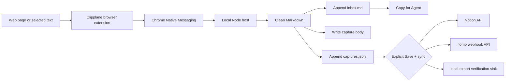

<p align="center">
  
</p>

<h1 align="center">Clipplane</h1>

<p align="center">
  Keep the part that matters as an inspectable note.
  <br>
  Save a selection, readable page, or page element to a local <code>inbox.md</code>, then hand it directly to an Agent or sync only when you choose.
</p>

<p align="center">
  <a href="README.md">中文 README</a> · <a href="https://kkenny0.github.io/Clipplane/">Product</a> · <a href="https://kkenny0.github.io/Clipplane/setup/">Setup</a> · <a href="https://kkenny0.github.io/Clipplane/privacy/">Privacy</a> · <a href="https://kkenny0.github.io/Clipplane/support/">Help</a>
</p>

Clipplane is a local capture inbox for people and Agents, with two parts: a browser extension and a Native Messaging host. The extension captures a selection, readable page, or chosen element by an explicit boundary. The local host cleans it into Markdown and writes it into your notes folder. Each clip becomes a traceable local capture before you process it, hand it to an Agent, or optionally sync it elsewhere.

The extension's first-install page checks the Host version. On macOS arm64 it links only to an asset in an immutable GitHub Release with a pinned digest and Apple Team ID; on Windows it points to a commit-pinned source setup guide. The Host reports an explicit protocol version so an outdated local component can be distinguished from a missing one.

## Current Status

Current source is the breaking `0.8.0` storage candidate: the active Inbox is Markdown and Host protocol is 3. The published stable extension is `0.7.7`, with a macOS-first distribution boundary:

- GitHub Releases provide `clipplane-extension-v0.7.7.zip` for manual `Load unpacked`, with canonical extension ID `emacefnmbogjdcblglmipolnickjnmbl`.
- macOS arm64 keeps the signed, notarized, and stapled Host `0.7.6` package; the immutable `v0.7.7` release pins SHA-256 `2d2c…fa4d6` and Apple Team ID `S7V7CK2G9T`.
- Windows has no public binary installer. Users need Git and Node 24.13 or later in the Node 24 line, then run the PowerShell setup from the full commit SHA documented below.
- The Chrome Web Store item has not been submitted or published, and Clipplane is not on Edge Add-ons.
- Setup allows both the canonical Store ID and the legacy GitHub dev-preview ID during migration, so users do not need to copy an ID.
- Edge Add-ons can be handled later as a separate free store-distribution path.

Chrome Native Messaging requires the local host to list the exact extension origins allowed to access it. Wildcards are not allowed. Clipplane's `manifest.key` is the public identity key from Chrome Web Store, keeping a locally loaded `0.7.7` candidate aligned with the Store Item ID. It is not a signing private key, and the repo does not store `.pem` files or other private keys. Store packaging removes this field from the staging copy before upload.

## 5-Minute Start

### 1. Prepare the files

For a quick trial, first download `clipplane-extension-v0.7.7.zip`. macOS arm64 users also download the signed `.pkg` from the same immutable Release. Windows users install Git and Node 24.13 or later in the Node 24 line, then use the pinned source commit below; do not execute a tag's `Source code` archive.

Windows x64 uses the reviewed Host `0.7.6` source commit:

```powershell
$clipplaneCommit = "3c7f01bf3af587a6af7a3fdb45b8b6484fca1707"
git clone https://github.com/KKenny0/Clipplane.git
Set-Location .\Clipplane
git checkout --detach $clipplaneCommit
if ((git rev-parse HEAD).Trim() -ne $clipplaneCommit) { throw "Clipplane commit verification failed." }
npm ci --omit=dev --ignore-scripts
npm run smoke
```

If you are running directly from the Git repo, run the same commands from the repo root. `smoke` writes a temporary `inbox.md` under the system temp directory so you can confirm the local clip core works.

### 2. Load the browser extension

1. Open `chrome://extensions` or `edge://extensions`.
2. Enable `Developer mode`.
3. Click `Load unpacked`.
4. Select the unzipped `clipplane-extension-vX` folder, or the source repo's `extension` folder.
5. Current source and the `0.7.7` package should show `emacefnmbogjdcblglmipolnickjnmbl`; the published `v0.5.0` dev-preview package still shows legacy ID `mhgcfphfcgbgabhbegdonadkedfaddhc`.

### 3. Register the local host

On macOS arm64, open the Release `.pkg`, complete installation, then fully quit and reopen the browser. Windows uses the best-effort source setup path:

Windows Chrome:

```powershell
pwsh -NoLogo -NoProfile -File .\scripts\setup-windows.ps1 -Browser chrome
```

Windows Edge:

```powershell
pwsh -NoLogo -NoProfile -File .\scripts\setup-windows.ps1 -Browser edge
```

The macOS source setup below is only for maintainer debugging. Chrome:

```bash
bash scripts/setup-macos.sh --browser chrome
```

macOS Edge:

```bash
bash scripts/setup-macos.sh --browser edge
```

### 4. Check the install

```powershell
npm run doctor
```

If the popup says `Host unavailable`, copy the setup command shown in the popup and rerun it. Only development builds or custom manifests need the advanced manual extension ID override.

### 5. Clip something

Open any page and click the Clipplane extension:

- `Selection`: save the current selected text; without a selection, it falls back to page capture.
- `Page`: prefer readable article extraction and fall back to locally de-noised page content.
- `Element`: click `Choose area`, then choose a paragraph, card, comment, or page region.
- `Save local`: save only locally. `Save + sync`: save locally first, then sync to enabled external sinks.

You can also select text and clip it from the context menu.

## Product Preview

<table>
  <tr>
    <th>Clipper popup</th>
    <th>Settings page</th>
  </tr>
  <tr>
    <td valign="top"></td>
    <td valign="top"></td>
  </tr>
</table>

## What Clipplane Saves

By default Clipplane writes:

- `~/Documents/notes/inbox.md`
- `~/Documents/notes/.clipplane/captures.jsonl`
- `~/Documents/notes/.clipplane/captures/<capture-id>.md`

`inbox.md` is the workspace where you process clips. `captures.jsonl` and `captures/` under `.clipplane` are Clipplane-managed history, deduplication, retry, and sync state. Every `captures/<CAPTURE_ID>.md` is a self-contained Capture Document: fixed YAML frontmatter carries title, source, author, publication and capture times, tags, and capture method, followed by the original Markdown body. An Agent can work from that file alone. External sync strips the Clipplane frontmatter to avoid duplicate properties.

On the first upgrade from 0.7.x, the Host retains `inbox.org` and creates immutable `.clipplane/backups/inbox-v2.org` and `.clipplane/backups/captures-v2.jsonl` backups. Existing bodies are wrapped losslessly, with their pre-wrapper versions retained in `.clipplane/backups/capture-bodies-v0/`. A missing active body is recovered only when its matching Org entry has non-empty content, and is marked with `recovery: "legacy_org"`. After an exclusive, verified publish, runtime writes go only to Markdown. Migration stops without overwriting or deleting files if the Org source changes, a Markdown destination appears, backups conflict, or unmanaged preamble content is found.

`captures.jsonl` does not persist device-specific absolute paths. On each device, Clipplane resolves `inbox.md`, capture bodies, and local exports from the current `Storage` folder plus `CAPTURE_ID`, so the complete notes folder can move through Git between Windows, macOS, and different home directories. Absolute paths written by older versions are ignored and migrate to the portable format the next time that record changes.

After records migrate, do not downgrade to an older Host that does not support portable records; it cannot reliably retry sync for those records. If the current Host encounters a record written by a newer version, History remains readable, but mutations are refused until the Host is upgraded.

This Git workflow assumes one writer at a time: commit and push on one device, then pull before continuing on another. Clipplane does not run Git automatically or resolve merge conflicts caused by two devices changing `captures.jsonl` or `inbox.md` concurrently.

After a successful save, duplicate, or reactivation, the result card's primary action is `Copy for Agent`. It copies a paste-ready title, source, and current-device Markdown body path for a local Agent session. `History` still exposes capture method and sync state; `Copy content` under `Manage` supports an Agent that cannot read local files. `Mark processed` removes the item from `inbox.md` while retaining its internal record and source snapshot; clipping it again returns it to the active Inbox. `Delete local copy` removes the Markdown Inbox entry, history record, snapshot, and managed local export. `Copy diagnostics` in Storage includes only OS, architecture, browser, extension, Host, protocol, and error code—never note paths, page content, or sync credentials.

## External Sync

External sinks are opt-in. Enabling one requires an explicit acknowledgement in Settings of what the external service receives. After consent and configuration are complete, `Save + sync` becomes available in the popup. Sync failure does not affect local save. See the [Privacy Policy](PRIVACY.md) for the full data boundary.

- flomo: enable flomo, paste the incoming webhook URL, and optionally add tags. Official pages: [API & URL Scheme](https://help.flomoapp.com/advance/api.html) and [flomo incoming webhook](https://flomoapp.com/mine?source=incoming_webhook). flomo API access requires Pro.
- Notion: enable Notion, then add a page ID and integration token. Official pages: [Notion API quickstart](https://developers.notion.com/guides/get-started/quick-start) and [Authorization](https://developers.notion.com/guides/get-started/authorization). Share the target page with the connection before syncing.

`notion-api` creates a Notion page through the official Notion API and does not use Notion MCP. `flomo-api` posts to flomo's incoming webhook API. `local-export` writes JSON files under `.clipplane/sinks/local-export/` and is mainly for local verification.

## Reference Workflow

Clipplane originally took inspiration from the local-first workflow in [lijigang/ljg-skill-clip](https://github.com/lijigang/ljg-skill-clip). Version `0.8.0` keeps the capture, cleanup, tagging, and Inbox structure, but no longer converts Markdown to Org. The same Markdown is readable by a person and directly usable by an Agent.

## How It Works



The native host keeps the full capture locally before any sync attempt. Phase 2 uses direct sink APIs for synchronization. It does not require Claude Code, Codex CLI, Agent CLI, or MCP to save or sync a clip.

## Development

Layout:

```text
extension/           Manifest V3 browser extension
native-host/         Native Messaging host and clip core
scripts/             install, uninstall, smoke, doctor, and packaging scripts
test/                node:test coverage for clip core and framing
```

Useful commands:

```powershell
npm test
npm run smoke
npm run smoke:sync:local
npm run doctor
npm run package:extension
npm run package:store
npm run verify:store
```

`npm run package:extension` writes `dist/clipplane-extension-vX.zip`, preserving the public identity key for local candidate testing. First and subsequent Chrome Web Store uploads use `npm run package:store`, which writes `dist/clipplane-store-vX.zip` after removing `key` from the staging manifest without changing the source manifest. `npm run verify:store` audits the Store ZIP and rejects `key`, private keys, `.env*`, Native Host files, executables, remote code, and permission expansion. Both ZIPs contain only the browser extension. Before packaging, Clipplane prepares the pinned `@mozilla/readability` extractor and its Apache-2.0 license.

Every public Host download record must pin its release tag, asset name, Host version, SHA-256 digest, and platform signing identity. `npm run verify:host:release` downloads the official release asset and verifies those claims. The Windows source path pins a full commit SHA instead of trusting a movable tag.

On Node 24.13 or later in the Node 24 line, `npm run package:host:windows` or `npm run package:host:macos` builds a target-native Host bundle with its own Node runtime and production dependencies. CI rebuilds and launches both bundles. These ZIP bundles are an installer input, not the signed `.pkg` promised to end users in the immutable `v0.7.7` release.

Build and verify a private unsigned Windows candidate in this order:

```powershell
npm run package:host:windows
node scripts/smoke-native-host-bundle.mjs --target windows
npm run package:host:windows:installer:candidate
npm run smoke:host:windows:installer
```

Unsigned candidate packaging consumes that prebuilt, smoke-tested bundle. The public signing command, `npm run package:host:windows:installer`, refuses dirty source and reruns `npm ci`, the bundle build, and the bundle smoke before it signs and verifies the same content. It also requires `CLIPPLANE_INNO_SETUP_COMPILER`, `CLIPPLANE_WINDOWS_SIGNTOOL`, `CLIPPLANE_WINDOWS_CERT_SUBJECT`, and `CLIPPLANE_WINDOWS_TIMESTAMP_URL`. Verify the final signed asset itself with `pwsh -File scripts/smoke-native-host-windows-installer.ps1 -InstallerPath <signed.exe>`. An unsigned candidate is private test input, never a public download.

The installer smoke changes the current user's install directory and Chrome/Edge HKCU registrations. Run it only in GitHub Actions, a disposable Windows VM, or a dedicated test account. It preserves existing Notion/flomo credentials with `/PRESERVECREDENTIALS`, but it is not a side-effect-free developer-machine check.

<details>
<summary>Advanced configuration</summary>

The Settings page writes a local app config file. You can still use environment variables for development:

```powershell
$env:CLIPPLANE_NOTES_DIR = "D:\notes"
$env:CLIPPLANE_NOTION_TOKEN = "secret_xxx"
$env:CLIPPLANE_FLOMO_WEBHOOK_URL = "https://flomoapp.com/iwh/..."
```

A browser-launched Native Messaging host only sees environment variables visible to the browser process, so this is not the recommended path for normal use.

For custom extension identity development, you can override the extension ID manually:

```powershell
pwsh -NoLogo -NoProfile -File .\scripts\setup-windows.ps1 -Browser chrome -ExtensionId "<extension-id>"
```

```bash
bash scripts/setup-macos.sh --browser chrome --extension-id "<extension-id>"
```

Config file shape:

```json
{
  "storage": {
    "notesDir": "D:\\notes"
  },
  "sync": {
    "defaultSinks": ["notion-api"]
  },
  "sinks": {
    "notion-api": {
      "enabled": true,
      "parentType": "page",
      "parentId": "NOTION_PAGE_ID"
    },
    "flomo-api": {
      "enabled": false,
      "tags": ["clipplane"]
    },
    "local-export": {
      "enabled": false
    }
  }
}
```

The Notion token and flomo webhook are intentionally absent from this file. On supported Windows and macOS systems they are stored in the operating system credential store. If that native backend is unavailable, external sync stays disabled rather than falling back to plaintext.

</details>

## Current Scope

Clipplane does not watch the clipboard, does not upload data by default, and does not run analysis skills automatically. It only clips when the user explicitly clicks the extension action or context menu, and it only syncs externally when the user clicks `Save + sync`. Element-picker highlighting and event listeners exist only after the user starts choosing an area, and are removed after confirmation, cancellation, or timeout.

## Troubleshooting

- `Specified native messaging host not found`: rerun the setup command for your browser, then run `npm run doctor`.
- `Access to the specified native messaging host is forbidden`: confirm the extension ID is canonical `emacefnmbogjdcblglmipolnickjnmbl` or migration legacy `mhgcfphfcgbgabhbegdonadkedfaddhc`, then rerun the setup command for that browser.
- `Nothing to clip`: select text first or use `Page` mode so Clipplane can collect the page body.
- Unsatisfactory page clips: use `Page` first; it prefers readable extraction and falls back automatically. For apps and non-article pages, use `Element` to choose the target region, or use `Selection` for exact text.
- Element mode cannot start: browser internal pages, the Chrome Web Store, and cross-origin iframes are isolated by the browser and cannot be clipped.
- `Capture history` says unreadable records were skipped: one line in `captures.jsonl` is likely malformed. Clipplane skips the bad line and keeps showing the rest of your local trail.

## Support

If Clipplane saves you time clipping web pages, maintaining a local inbox, or syncing notes to Notion / flomo, you can support continued maintenance here:

<https://kkenny0.github.io/support/>

Support helps keep the browser extension, local Native Messaging host, cross-platform setup flow, sync sinks, and documentation maintained.
