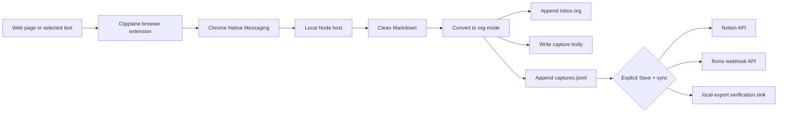

# Clipplane

[中文 README](README.md)

Clipplane is a local-first browser clipper. It captures the current page or selected text, sends it through a Native Messaging host, appends a clean org-mode entry to `~/Documents/notes/inbox.org`, and can explicitly sync that saved capture to optional external sinks.

## Product Preview

<table>
  <tr>
    <th>Clipper popup</th>
    <th>Settings page</th>
  </tr>
  <tr>
    <td valign="top"></td>
    <td valign="top"></td>
  </tr>
</table>

The product stays intentionally narrow:

- browser action and context-menu clipping
- local Native Messaging host
- `inbox.org` as the human-readable source of truth
- `.clipplane/captures.jsonl` as the machine-readable audit and retry log
- duplicate detection by content hash
- optional API sinks for Notion and flomo

Local save succeeds or fails independently of any external service. External sync only runs when the user clicks "Save + sync" and has configured at least one sink.

## Reference Workflow

Clipplane Phase 1 follows the clipping workflow from [lijigang/ljg-skill-clip](https://github.com/lijigang/ljg-skill-clip): capture a URL or text selection, clean it into Markdown, convert it into org-mode, tag it, and append it to a local `inbox.org`. Clipplane turns that workflow into a browser-triggered local app while keeping the same local-first storage boundary.

## How It Works



The native host keeps the full capture locally before any sync attempt. Phase 2 uses direct sink APIs for synchronization. It does not require Claude Code, Codex CLI, Agent CLI, or MCP to save or sync a clip.

## Layout

```text
extension/           Manifest V3 browser extension
native-host/         Native Messaging host and clip core
scripts/             install, uninstall, smoke, and doctor scripts
test/                node:test coverage for clip core and framing
```

## Develop

Run tests:

```powershell
pwsh -NoLogo -NoProfile -Command "npm test"
```

Run a local smoke clip without the browser:

```powershell
pwsh -NoLogo -NoProfile -Command "npm run smoke"
```

Run a local sync smoke test without network access:

```powershell
pwsh -NoLogo -NoProfile -Command "npm run smoke:sync:local"
```

Run environment checks:

```powershell
pwsh -NoLogo -NoProfile -Command "npm run doctor"
```

## Quick Local Smoke Test

Before loading the extension, verify the local clip core:

```powershell
pwsh -NoLogo -NoProfile -Command "npm run smoke"
```

This writes a temporary `inbox.org` under the system temp directory and prints the captured org entry.

## Load The Extension

1. Open `chrome://extensions` or `edge://extensions`.
2. Enable Developer mode.
3. Click "Load unpacked".
4. Select the `extension` folder.
5. Copy the generated extension ID.

## Install The Native Host On Windows

Install for Chrome:

```powershell
pwsh -NoLogo -NoProfile -File .\scripts\install-native-host.ps1 -Browser chrome -ExtensionId "<extension-id>"
```

Install for Edge:

```powershell
pwsh -NoLogo -NoProfile -File .\scripts\install-native-host.ps1 -Browser edge -ExtensionId "<extension-id>"
```

The installer writes `native-host/com.clipplane.host.json` and registers it under the current user's Native Messaging registry key.

Verify the Chrome host registration:

```powershell
pwsh -NoLogo -NoProfile -File .\scripts\check-native-host.ps1 -Browser chrome -ExtensionId "<extension-id>"
```

Uninstall:

```powershell
pwsh -NoLogo -NoProfile -File .\scripts\uninstall-native-host.ps1 -Browser chrome
```

## Data Files

By default Clipplane writes:

- `~/Documents/notes/inbox.org`
- `~/Documents/notes/.clipplane/captures.jsonl`
- `~/Documents/notes/.clipplane/captures/<capture-id>.md`

Open `Settings` in the extension to view the current folder, change it, or open it in your file manager. Normal users do not need environment variables or launcher edits.

Clipplane stores app settings in the system application config directory. Clipped content stays in the notes folder you choose.

## External Sinks

External sinks are opt-in. Configure them in the extension `Settings` page:

- flomo: enable flomo, paste the incoming webhook URL, and optionally add tags. Official pages: [API & URL Scheme](https://help.flomoapp.com/advance/api.html) and [flomo incoming webhook](https://flomoapp.com/mine?source=incoming_webhook). flomo API access requires Pro.
- Notion: enable Notion, then add a page ID and integration token. Official pages: [Notion API quickstart](https://developers.notion.com/guides/get-started/quick-start) and [Authorization](https://developers.notion.com/guides/get-started/authorization). Share the target page with the connection before syncing.

After at least one sink is ready, `Save + sync` becomes available in the popup. Sync failure does not affect local save.

`notion-api` creates a Notion page through the official Notion API and does not use Notion MCP. `flomo-api` posts to flomo's incoming webhook API and requires flomo Pro access. `local-export` writes JSON files under `.clipplane/sinks/local-export/` and is mainly for local verification.

<details>
<summary>Advanced configuration</summary>

The Settings page writes a local app config file. You can still use environment variables for development:

```powershell
$env:CLIPPLANE_NOTES_DIR = "D:\notes"
$env:CLIPPLANE_NOTION_TOKEN = "secret_xxx"
$env:CLIPPLANE_FLOMO_WEBHOOK_URL = "https://flomoapp.com/iwh/..."
```

A browser-launched Native Messaging host only sees environment variables visible to the browser process, so this is not the recommended path for normal use.

Config file shape:

```json
{
  "storage": {
    "notesDir": "D:\\notes"
  },
  "sync": {
    "defaultSinks": ["notion-api"]
  },
  "sinks": {
    "notion-api": {
      "enabled": true,
      "parentType": "page",
      "parentId": "NOTION_PAGE_ID",
      "token": "secret_xxx"
    },
    "flomo-api": {
      "enabled": false,
      "webhookUrl": "https://flomoapp.com/iwh/...",
      "tags": ["clipplane"]
    },
    "local-export": {
      "enabled": false
    }
  }
}
```

</details>

## Current Scope

Clipplane does not watch the clipboard, does not upload data by default, and does not run analysis skills automatically. It only clips when the user explicitly clicks the extension action or context menu, and it only syncs externally when the user clicks "Save + sync".

## Troubleshooting

- `Specified native messaging host not found`: run `check-native-host.ps1` for the browser you loaded the extension in.
- `Access to the specified native messaging host is forbidden`: reinstall with the exact extension ID shown on `chrome://extensions` or `edge://extensions`.
- `Nothing to clip`: select text first or use "Clip Page" so Clipplane can collect the page body.
- Empty or noisy page clips: clip a selection. Phase 1 uses a lightweight DOM extractor instead of a full readability engine.
