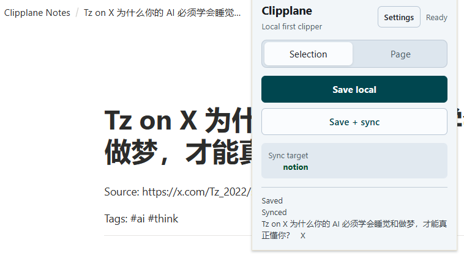
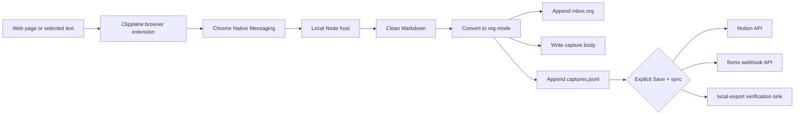

<p align="center">
  
</p>

<h1 align="center">Clipplane</h1>

<p align="center">
  A local-first browser clipper. Save pages and selections to your local <code>inbox.org</code> first, then sync to Notion or flomo when you choose.
</p>

<p align="center">
  <a href="README.md">中文 README</a>
</p>

Clipplane has two parts: a browser extension and a local Native Messaging host. The extension captures the page or selection. The local host cleans the content, converts it to org-mode, and writes it into your notes folder. External services are optional sinks, not a requirement for saving.

## Current Status

Clipplane is still a dev preview:

- GitHub Releases provide a packaged extension zip for manual `Load unpacked`.
- The local host and setup scripts come from the source repo, or from the Release `Source code` package.
- Clipplane is not yet published on the Chrome Web Store or Edge Add-ons.
- The setup script still needs the extension ID generated by your browser.
- `v0.4` will focus on store distribution and a lower-friction host installer.

Chrome Native Messaging requires the local host to list the exact extension origins allowed to access it. Wildcards are not allowed. Before store distribution, manually loaded extension IDs are generated by the browser, so the setup script needs that ID to write the local manifest.

## 5-Minute Start

### 1. Prepare the files

For a quick trial, download two files from the latest Release:

- `Source code`: the local host and setup scripts.
- `clipplane-extension-vX.zip`: the browser extension package.

Unzip both into stable folders. Then run this from the `Source code` folder:

```powershell
npm install
npm run smoke
```

If you are running directly from the Git repo, run the same commands from the repo root. `smoke` writes a temporary `inbox.org` under the system temp directory so you can confirm the local clip core works.

### 2. Load the browser extension

1. Open `chrome://extensions` or `edge://extensions`.
2. Enable `Developer mode`.
3. Click `Load unpacked`.
4. Select the unzipped `clipplane-extension-vX` folder, or the source repo's `extension` folder.
5. Copy the extension ID shown by the browser.

### 3. Register the local host

Windows Chrome:

```powershell
pwsh -NoLogo -NoProfile -File .\scripts\setup-windows.ps1 -Browser chrome -ExtensionId "<extension-id>"
```

Windows Edge:

```powershell
pwsh -NoLogo -NoProfile -File .\scripts\setup-windows.ps1 -Browser edge -ExtensionId "<extension-id>"
```

macOS Chrome:

```bash
bash scripts/setup-macos.sh --browser chrome --extension-id "<extension-id>"
```

macOS Edge:

```bash
bash scripts/setup-macos.sh --browser edge --extension-id "<extension-id>"
```

### 4. Check the install

```powershell
npm run doctor
```

If the popup says `Host unavailable`, the extension ID is usually mismatched. Copy the exact ID from the browser extensions page and rerun the matching setup command.

### 5. Clip something

Open any page and click the Clipplane extension:

- `Save local`: save only to local files.
- `Save + sync`: save locally first, then sync to enabled external sinks.

You can also select text and clip it from the context menu.

## Product Preview

<table>
  <tr>
    <th>Clipper popup</th>
    <th>Settings page</th>
  </tr>
  <tr>
    <td valign="top"></td>
    <td valign="top"></td>
  </tr>
</table>

### Notion Sync Result

After the Notion sink is enabled, `Save + sync` saves the clip locally first, then creates a page under the target Notion page.

<p align="center">
  
</p>

## What Clipplane Saves

By default Clipplane writes:

- `~/Documents/notes/inbox.org`
- `~/Documents/notes/.clipplane/captures.jsonl`
- `~/Documents/notes/.clipplane/captures/<capture-id>.md`

`inbox.org` is the human-readable source of truth. `captures.jsonl` and `captures/` are machine-readable audit, retry, and sync records. Clipplane skips duplicate clips by content hash.

Open `Settings` in the extension to view the current folder, change it, or open it in your file manager. Normal users do not need environment variables or launcher edits.

## External Sync

External sinks are opt-in. After at least one sink is ready, `Save + sync` becomes available in the popup. Sync failure does not affect local save.

- flomo: enable flomo, paste the incoming webhook URL, and optionally add tags. Official pages: [API & URL Scheme](https://help.flomoapp.com/advance/api.html) and [flomo incoming webhook](https://flomoapp.com/mine?source=incoming_webhook). flomo API access requires Pro.
- Notion: enable Notion, then add a page ID and integration token. Official pages: [Notion API quickstart](https://developers.notion.com/guides/get-started/quick-start) and [Authorization](https://developers.notion.com/guides/get-started/authorization). Share the target page with the connection before syncing.

`notion-api` creates a Notion page through the official Notion API and does not use Notion MCP. `flomo-api` posts to flomo's incoming webhook API. `local-export` writes JSON files under `.clipplane/sinks/local-export/` and is mainly for local verification.

## Reference Workflow

Clipplane follows the clipping workflow from [lijigang/ljg-skill-clip](https://github.com/lijigang/ljg-skill-clip): capture a URL or text selection, clean it into Markdown, convert it into org-mode, tag it, and append it to a local `inbox.org`. Clipplane turns that workflow into a browser-triggered local app while keeping the same local-first storage boundary.

## How It Works



The native host keeps the full capture locally before any sync attempt. Phase 2 uses direct sink APIs for synchronization. It does not require Claude Code, Codex CLI, Agent CLI, or MCP to save or sync a clip.

## Development

Layout:

```text
extension/           Manifest V3 browser extension
native-host/         Native Messaging host and clip core
scripts/             install, uninstall, smoke, doctor, and packaging scripts
test/                node:test coverage for clip core and framing
```

Useful commands:

```powershell
npm test
npm run smoke
npm run smoke:sync:local
npm run doctor
npm run package:extension
```

`npm run package:extension` writes `dist/clipplane-extension-vX.zip` for GitHub Release assets. This zip only contains the browser extension. The native host still ships with the source package.

<details>
<summary>Advanced configuration</summary>

The Settings page writes a local app config file. You can still use environment variables for development:

```powershell
$env:CLIPPLANE_NOTES_DIR = "D:\notes"
$env:CLIPPLANE_NOTION_TOKEN = "secret_xxx"
$env:CLIPPLANE_FLOMO_WEBHOOK_URL = "https://flomoapp.com/iwh/..."
```

A browser-launched Native Messaging host only sees environment variables visible to the browser process, so this is not the recommended path for normal use.

Config file shape:

```json
{
  "storage": {
    "notesDir": "D:\\notes"
  },
  "sync": {
    "defaultSinks": ["notion-api"]
  },
  "sinks": {
    "notion-api": {
      "enabled": true,
      "parentType": "page",
      "parentId": "NOTION_PAGE_ID",
      "token": "secret_xxx"
    },
    "flomo-api": {
      "enabled": false,
      "webhookUrl": "https://flomoapp.com/iwh/...",
      "tags": ["clipplane"]
    },
    "local-export": {
      "enabled": false
    }
  }
}
```

</details>

## Current Scope

Clipplane does not watch the clipboard, does not upload data by default, and does not run analysis skills automatically. It only clips when the user explicitly clicks the extension action or context menu, and it only syncs externally when the user clicks `Save + sync`.

## Troubleshooting

- `Specified native messaging host not found`: run `check-native-host.ps1` for the browser you loaded the extension in.
- `Access to the specified native messaging host is forbidden`: reinstall with the exact extension ID shown on `chrome://extensions` or `edge://extensions`.
- `Nothing to clip`: select text first or use `Page` mode so Clipplane can collect the page body.
- Empty or noisy page clips: clip a selection. The current version uses a lightweight DOM extractor instead of a full readability engine.
