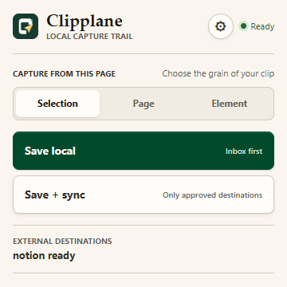
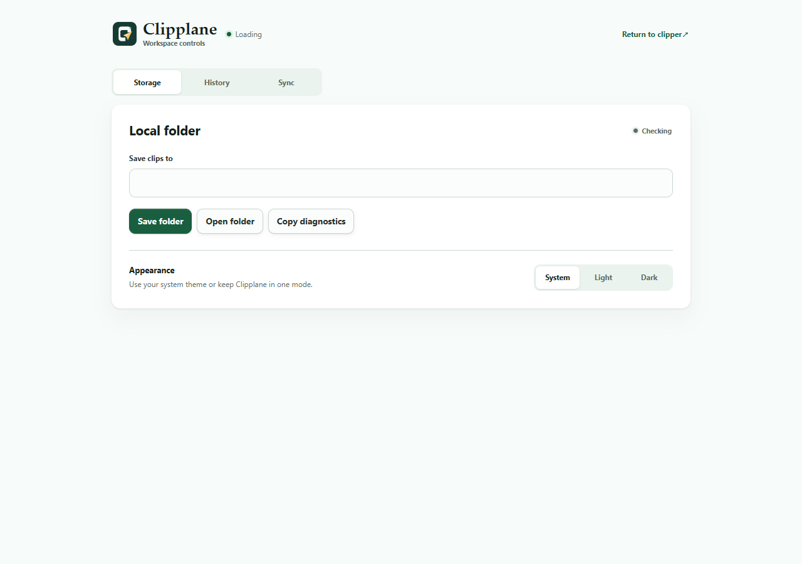
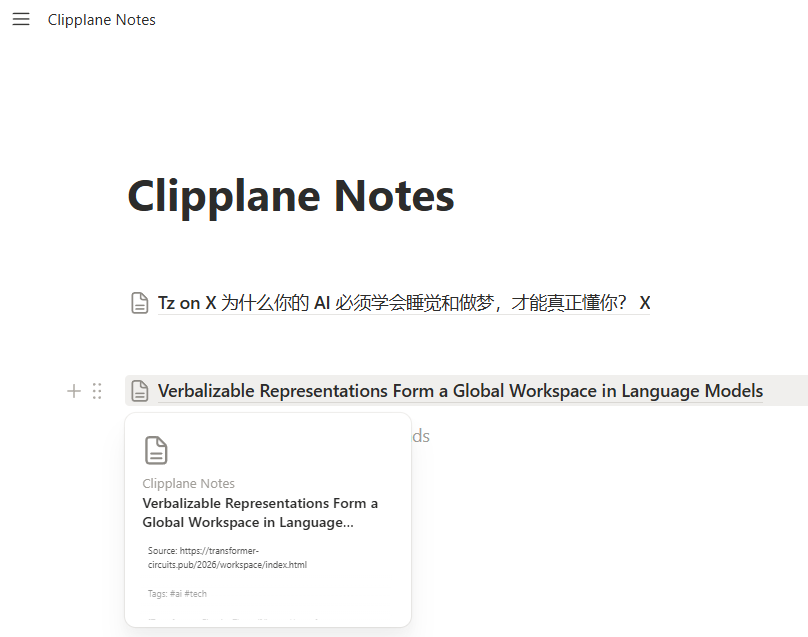
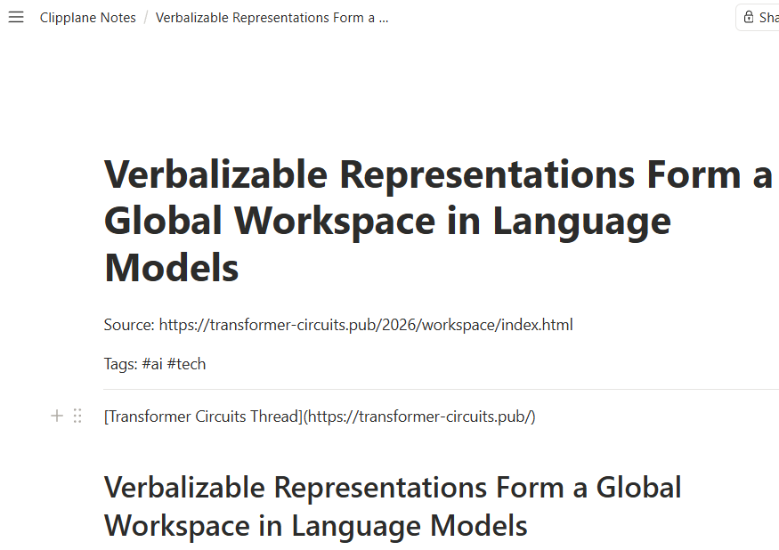
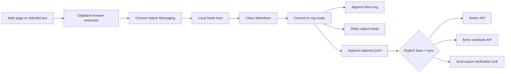

<p align="center">
  
</p>

<h1 align="center">Clipplane</h1>

<p align="center">
  Keep web clips on your machine first.
  <br>
  Save pages or selected text to a local <code>inbox.org</code>, inspect the capture trail later, and sync to Notion or flomo only when you choose.
</p>

<p align="center">
  <a href="README.md">中文 README</a> · <a href="https://kkenny0.github.io/Clipplane/">Product</a> · <a href="https://kkenny0.github.io/Clipplane/setup/">Setup</a> · <a href="https://kkenny0.github.io/Clipplane/privacy/">Privacy</a> · <a href="https://kkenny0.github.io/Clipplane/support/">Help</a>
</p>

Clipplane is a local-first web clipper with two parts: a browser extension and a local Native Messaging host. The extension captures the page or selection. The local host cleans the content, converts it to org-mode, and writes it into your notes folder. External services are optional sinks, not a requirement for saving.

The extension's first-install page checks the Host version and links to a version-matched GitHub Release asset. The Host reports an explicit protocol version so an outdated local component can be distinguished from a missing one.

## Current Status

Clipplane's public release is still a GitHub dev preview; the current source is now the `0.6.0` Chrome Web Store candidate:

- GitHub Releases provide a packaged extension zip for manual `Load unpacked`, with the stable extension ID `mhgcfphfcgbgabhbegdonadkedfaddhc`.
- The current `0.6.0` source and Chrome Web Store draft use canonical extension ID `emacefnmbogjdcblglmipolnickjnmbl`.
- The local host and setup scripts come from the source repo, or from the Release `Source code` package.
- The Chrome Web Store item has not been submitted or published, and Clipplane is not on Edge Add-ons.
- Setup allows both the canonical Store ID and the legacy GitHub dev-preview ID during migration, so users do not need to copy an ID.
- Edge Add-ons can be handled later as a separate free store-distribution path.

Chrome Native Messaging requires the local host to list the exact extension origins allowed to access it. Wildcards are not allowed. Clipplane's `manifest.key` is the public identity key from Chrome Web Store, keeping a locally loaded `0.6.0` candidate aligned with the Store Item ID. It is not a signing private key, and the repo does not store `.pem` files or other private keys. Store packaging removes this field from the staging copy before upload.

## 5-Minute Start

### 1. Prepare the files

For a quick trial, download two files from the latest Release:

- `Source code`: the local host and setup scripts.
- `clipplane-extension-vX.zip`: the browser extension package.

Unzip both into stable folders. Then run this from the `Source code` folder:

```powershell
npm install
npm run smoke
```

If you are running directly from the Git repo, run the same commands from the repo root. `smoke` writes a temporary `inbox.org` under the system temp directory so you can confirm the local clip core works.

### 2. Load the browser extension

1. Open `chrome://extensions` or `edge://extensions`.
2. Enable `Developer mode`.
3. Click `Load unpacked`.
4. Select the unzipped `clipplane-extension-vX` folder, or the source repo's `extension` folder.
5. Current source and `0.6.0` candidates should show `emacefnmbogjdcblglmipolnickjnmbl`; the published `v0.5.0` dev-preview package still shows legacy ID `mhgcfphfcgbgabhbegdonadkedfaddhc`.

### 3. Register the local host

Windows Chrome:

```powershell
pwsh -NoLogo -NoProfile -File .\scripts\setup-windows.ps1 -Browser chrome
```

Windows Edge:

```powershell
pwsh -NoLogo -NoProfile -File .\scripts\setup-windows.ps1 -Browser edge
```

macOS Chrome:

```bash
bash scripts/setup-macos.sh --browser chrome
```

macOS Edge:

```bash
bash scripts/setup-macos.sh --browser edge
```

### 4. Check the install

```powershell
npm run doctor
```

If the popup says `Host unavailable`, copy the setup command shown in the popup and rerun it. Only development builds or custom manifests need the advanced manual extension ID override.

### 5. Clip something

Open any page and click the Clipplane extension:

- `Selection`: save the current selected text; without a selection, it falls back to page capture.
- `Page`: prefer readable article extraction and fall back to locally de-noised page content.
- `Element`: click `Choose area`, then choose a paragraph, card, comment, or page region.
- `Save local`: save only locally. `Save + sync`: save locally first, then sync to enabled external sinks.

You can also select text and clip it from the context menu.

## Product Preview

<table>
  <tr>
    <th>Clipper popup</th>
    <th>Settings page</th>
  </tr>
  <tr>
    <td valign="top"></td>
    <td valign="top"></td>
  </tr>
</table>

### Notion Sync

After the Notion sink is enabled, `Save + sync` saves the clip locally first, then creates a page under the target Notion page.

<table>
  <tr>
    <th>Sync from Clipplane</th>
    <th>Page created in Notion</th>
  </tr>
  <tr>
    <td valign="top"></td>
    <td valign="top"></td>
  </tr>
</table>

## What Clipplane Saves

By default Clipplane writes:

- `~/Documents/notes/inbox.org`
- `~/Documents/notes/.clipplane/captures.jsonl`
- `~/Documents/notes/.clipplane/captures/<capture-id>.md`

`inbox.org` is the workspace where you process clips. `captures.jsonl` and `captures/` under `.clipplane` are Clipplane-managed history, deduplication, retry, and sync state; you do not need to maintain them separately. All three representations refer to one capture through its `CAPTURE_ID`.

The extension `Settings` page has `Storage`, `History`, and `Sync` tabs. Use `Storage` to inspect or change the local folder. In `History`, review recent clips, local body files, capture methods, and sync status, or mark an item as processed or permanently delete its local copy. `Mark processed` removes the item from `inbox.org` while retaining its internal record and source snapshot under Processed; clipping the same content again returns that item to Active and `inbox.org`. `Delete local copy` removes the Org entry, history record, source snapshot, and Clipplane-managed local-export copy together, but does not delete content already sent to Notion or flomo. Use `Sync` to configure those optional destinations. Normal users do not need environment variables or launcher edits.

## External Sync

External sinks are opt-in. Enabling one requires an explicit acknowledgement in Settings of what the external service receives. After consent and configuration are complete, `Save + sync` becomes available in the popup. Sync failure does not affect local save. See the [Privacy Policy](PRIVACY.md) for the full data boundary.

- flomo: enable flomo, paste the incoming webhook URL, and optionally add tags. Official pages: [API & URL Scheme](https://help.flomoapp.com/advance/api.html) and [flomo incoming webhook](https://flomoapp.com/mine?source=incoming_webhook). flomo API access requires Pro.
- Notion: enable Notion, then add a page ID and integration token. Official pages: [Notion API quickstart](https://developers.notion.com/guides/get-started/quick-start) and [Authorization](https://developers.notion.com/guides/get-started/authorization). Share the target page with the connection before syncing.

`notion-api` creates a Notion page through the official Notion API and does not use Notion MCP. `flomo-api` posts to flomo's incoming webhook API. `local-export` writes JSON files under `.clipplane/sinks/local-export/` and is mainly for local verification.

## Reference Workflow

Clipplane follows the clipping workflow from [lijigang/ljg-skill-clip](https://github.com/lijigang/ljg-skill-clip): capture a URL or text selection, clean it into Markdown, convert it into org-mode, tag it, and append it to a local `inbox.org`. Clipplane turns that workflow into a browser-triggered local app while keeping the same local-first storage boundary.

## How It Works



The native host keeps the full capture locally before any sync attempt. Phase 2 uses direct sink APIs for synchronization. It does not require Claude Code, Codex CLI, Agent CLI, or MCP to save or sync a clip.

## Development

Layout:

```text
extension/           Manifest V3 browser extension
native-host/         Native Messaging host and clip core
scripts/             install, uninstall, smoke, doctor, and packaging scripts
test/                node:test coverage for clip core and framing
```

Useful commands:

```powershell
npm test
npm run smoke
npm run smoke:sync:local
npm run doctor
npm run package:extension
npm run package:store
npm run verify:store
```

`npm run package:extension` writes `dist/clipplane-extension-vX.zip`, preserving the public identity key for local candidate testing. First and subsequent Chrome Web Store uploads use `npm run package:store`, which writes `dist/clipplane-store-vX.zip` after removing `key` from the staging manifest without changing the source manifest. `npm run verify:store` audits the Store ZIP and rejects `key`, private keys, `.env*`, Native Host files, executables, remote code, and permission expansion. Both ZIPs contain only the browser extension. Before packaging, Clipplane prepares the pinned `@mozilla/readability` extractor and its Apache-2.0 license.

On Node 20.19 or later in the Node 20 line, `npm run package:host:windows` or `npm run package:host:macos` builds a target-native Host bundle with its own Node runtime and production dependencies. CI rebuilds and launches both bundles. These ZIP bundles are an installer input, not the signed `.exe` or notarized `.pkg` promised to end users for `0.6.0`.

<details>
<summary>Advanced configuration</summary>

The Settings page writes a local app config file. You can still use environment variables for development:

```powershell
$env:CLIPPLANE_NOTES_DIR = "D:\notes"
$env:CLIPPLANE_NOTION_TOKEN = "secret_xxx"
$env:CLIPPLANE_FLOMO_WEBHOOK_URL = "https://flomoapp.com/iwh/..."
```

A browser-launched Native Messaging host only sees environment variables visible to the browser process, so this is not the recommended path for normal use.

For custom extension identity development, you can override the extension ID manually:

```powershell
pwsh -NoLogo -NoProfile -File .\scripts\setup-windows.ps1 -Browser chrome -ExtensionId "<extension-id>"
```

```bash
bash scripts/setup-macos.sh --browser chrome --extension-id "<extension-id>"
```

Config file shape:

```json
{
  "storage": {
    "notesDir": "D:\\notes"
  },
  "sync": {
    "defaultSinks": ["notion-api"]
  },
  "sinks": {
    "notion-api": {
      "enabled": true,
      "parentType": "page",
      "parentId": "NOTION_PAGE_ID"
    },
    "flomo-api": {
      "enabled": false,
      "tags": ["clipplane"]
    },
    "local-export": {
      "enabled": false
    }
  }
}
```

The Notion token and flomo webhook are intentionally absent from this file. On supported Windows and macOS systems they are stored in the operating system credential store. If that native backend is unavailable, external sync stays disabled rather than falling back to plaintext.

</details>

## Current Scope

Clipplane does not watch the clipboard, does not upload data by default, and does not run analysis skills automatically. It only clips when the user explicitly clicks the extension action or context menu, and it only syncs externally when the user clicks `Save + sync`. Element-picker highlighting and event listeners exist only after the user starts choosing an area, and are removed after confirmation, cancellation, or timeout.

## Troubleshooting

- `Specified native messaging host not found`: rerun the setup command for your browser, then run `npm run doctor`.
- `Access to the specified native messaging host is forbidden`: confirm the extension ID is canonical `emacefnmbogjdcblglmipolnickjnmbl` or migration legacy `mhgcfphfcgbgabhbegdonadkedfaddhc`, then rerun the setup command for that browser.
- `Nothing to clip`: select text first or use `Page` mode so Clipplane can collect the page body.
- Unsatisfactory page clips: use `Page` first; it prefers readable extraction and falls back automatically. For apps and non-article pages, use `Element` to choose the target region, or use `Selection` for exact text.
- Element mode cannot start: browser internal pages, the Chrome Web Store, and cross-origin iframes are isolated by the browser and cannot be clipped.
- `Capture history` says unreadable records were skipped: one line in `captures.jsonl` is likely malformed. Clipplane skips the bad line and keeps showing the rest of your local trail.

## Support

If Clipplane saves you time clipping web pages, maintaining a local inbox, or syncing notes to Notion / flomo, you can support continued maintenance here:

<https://kkenny0.github.io/support/>

Support helps keep the browser extension, local Native Messaging host, cross-platform setup flow, sync sinks, and documentation maintained.
