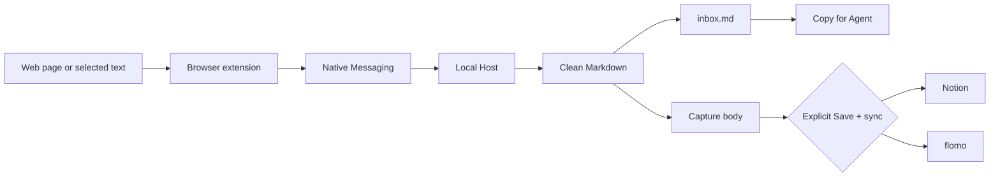

<p align="center">
  
</p>

<h1 align="center">Clipplane</h1>

<p align="center">
  Keep the part of a web page that matters as inspectable local Markdown.
  <br>
  Process it yourself, hand it directly to an Agent, or sync it to Notion or flomo when you choose.
</p>

<p align="center">
  <a href="README.md">中文 README</a> · <a href="https://kkenny0.github.io/Clipplane/">Product</a> · <a href="https://kkenny0.github.io/Clipplane/setup/">Setup</a> · <a href="https://kkenny0.github.io/Clipplane/privacy/">Privacy</a> · <a href="https://kkenny0.github.io/Clipplane/support/">Help</a>
</p>

<table>
  <tr>
    <th>Clipper popup</th>
    <th>Settings page</th>
  </tr>
  <tr>
    <td valign="top"></td>
    <td valign="top"></td>
  </tr>
</table>

Clipplane combines a browser extension with a local Native Messaging Host. The extension captures a selection, readable page, or chosen element. The local Host cleans it into Markdown and writes it to your notes folder. Every clip becomes a traceable local capture before you decide whether to process it, hand it to an Agent, or sync it elsewhere.

The current stable release is `0.8.0`. macOS arm64 has a signed and notarized Host package. Windows x64 currently installs the Host from pinned source. Clipplane is not yet available through Chrome Web Store or Edge Add-ons.

## How Clipplane works



The full capture is written locally before any external sync attempt. Saving and local processing do not require Claude Code, Codex CLI, Agent CLI, or MCP.

## Install

Download and extract `clipplane-extension-v0.8.0.zip` from the [`v0.8.0` Release](https://github.com/KKenny0/Clipplane/releases/tag/v0.8.0).

### macOS arm64

1. Download and install the signed `.pkg` from the same Release.
2. Fully quit and reopen Chrome or Edge.
3. Load the browser extension using the steps below.

### Windows x64

Windows requires Git and Node 24.13 or later in the Node 24 line. Host `0.8.0` uses this reviewed source commit:

```powershell
$clipplaneCommit = "ffe658b1820cafda130684f8b98b467052136426"
git clone https://github.com/KKenny0/Clipplane.git
Set-Location .\Clipplane
git checkout --detach $clipplaneCommit
if ((git rev-parse HEAD).Trim() -ne $clipplaneCommit) { throw "Clipplane commit verification failed." }
npm ci --omit=dev --ignore-scripts
npm run smoke
pwsh -NoLogo -NoProfile -File .\scripts\setup-windows.ps1 -Browser chrome
```

For Edge, change `chrome` on the last line to `edge`. Do not execute the automatically generated `Source code` archives on the tag page.

### Load the browser extension

1. Open `chrome://extensions` or `edge://extensions`.
2. Enable `Developer mode`.
3. Click `Load unpacked`.
4. Select the extracted `clipplane-extension-v0.8.0` folder, or the source repository's `extension` folder.
5. Confirm that the extension ID is `emacefnmbogjdcblglmipolnickjnmbl`.

Open the Clipplane popup. A `Ready` status means the installation works. From a source checkout, you can also run:

```powershell
npm run doctor
```

If the popup says `Host unavailable`, copy and rerun the setup command shown there. For `Specified native messaging host not found`, rerun setup for the current browser. For `Access to the specified native messaging host is forbidden`, confirm the extension ID before rerunning setup.

## Clip something

Open any web page and click the Clipplane extension:

- `Selection` saves the selected text and falls back to page capture when nothing is selected.
- `Page` prefers readable article extraction and falls back to locally cleaned page content.
- `Element` lets you choose a paragraph, card, comment, or page region after clicking `Choose area`.
- `Save local` writes only to local storage.
- `Save + sync` saves locally first, then sends the capture to enabled external services.

You can also select text and clip it from the context menu.

## Hand a capture to an Agent

After a successful capture, the result card's primary action is `Copy for Agent`. It copies a paste-ready title, source, and local Markdown body path for an Agent session.

Every capture has its own Markdown body. Fixed YAML frontmatter records the title, source, author, publication and capture times, tags, and capture method, followed by the original body. An Agent can get the complete context from this file alone.

`History` shows capture method, body state, and sync results. `Copy content` supports an Agent that cannot read local files. `Mark processed` removes an entry from `inbox.md` while keeping its history and body; clipping it again returns it to the Active Inbox. `Delete local copy` removes the Inbox entry, history record, body snapshot, and managed local export.

## Local files and History

Clipplane writes these files by default:

- `~/Documents/notes/inbox.md`
- `~/Documents/notes/.clipplane/captures.jsonl`
- `~/Documents/notes/.clipplane/captures/<capture-id>.md`

`inbox.md` is the workspace for unprocessed clips. Records and bodies under `.clipplane` are managed by Clipplane for History, deduplication, recovery, and sync. `captures.jsonl` does not store device-specific absolute paths, so the notes folder can move through Git between operating systems and home directories.

This Git workflow assumes one writer at a time. Commit and push on one device, then pull before continuing on another. Clipplane does not run Git or resolve conflicts caused by two devices editing `captures.jsonl` or `inbox.md` concurrently.

<details>
<summary>Upgrading an Org Inbox from 0.7.x</summary>

On the first upgrade, the Host keeps the original `inbox.org` and creates immutable `.clipplane/backups/inbox-v2.org` and `.clipplane/backups/captures-v2.jsonl` backups. Existing bodies are wrapped losslessly as Capture Documents, with the pre-wrapper versions retained under `.clipplane/backups/capture-bodies-v0/`.

A missing active body is recovered only when its matching Org entry contains non-empty content, and the record is marked with `recovery: "legacy_org"`. Runtime writes switch to Markdown after migration has been verified. Migration stops without overwriting or deleting the source if the Org file changes, the Markdown destination already exists, backups conflict, or unmanaged preamble content is found.

Do not downgrade to a Host that predates portable records after migration. If the current Host encounters a record written by a newer version, History remains readable, but the record cannot be changed until the Host is upgraded.

</details>

## Sync and privacy

Clipplane does not watch the clipboard, upload content by default, or run analysis skills automatically. It clips only after an explicit extension or context-menu action, and sends content elsewhere only after `Save + sync` is clicked. A sync failure never changes the local save.

- flomo: enable flomo, paste the incoming webhook URL, and optionally add tags. See [API & URL Scheme](https://help.flomoapp.com/advance/api.html) and [incoming webhook](https://flomoapp.com/mine?source=incoming_webhook). flomo API access requires Pro.
- Notion: enable Notion, enter a page ID and integration token, then share the target page with the connection. See [Notion API quickstart](https://developers.notion.com/guides/get-started/quick-start) and [Authorization](https://developers.notion.com/guides/get-started/authorization).

`Copy diagnostics` includes only the operating system, architecture, browser, extension, Host, protocol, and error code. It does not include note paths, page content, or sync credentials. See the [Privacy Policy](PRIVACY.md) for the full data boundary.

## Troubleshooting

- `Nothing to clip`: select text first or use `Page` mode to capture the page body.
- Unsatisfactory page captures: use `Page` for articles and documentation, `Element` for apps and non-article pages, or `Selection` for exact text.
- `Element` cannot start: browser internal pages, Chrome Web Store, and cross-origin iframes are isolated by the browser and cannot be captured.
- `Capture history` reports skipped unreadable records: one line in `captures.jsonl` is likely malformed. Clipplane skips that line and continues showing the rest of the capture trail.

See the [help page](https://kkenny0.github.io/Clipplane/support/) for more installation support.

## Development and release

```text
extension/           Manifest V3 browser extension
native-host/         Native Messaging Host and capture core
scripts/             install, uninstall, smoke, doctor, and packaging scripts
test/                node:test coverage for core behavior
```

Useful commands:

```powershell
npm test
npm run smoke
npm run doctor
npm run package:extension
npm run verify:extension
npm run package:store
npm run verify:store
```

- [Advanced configuration](docs/configuration.en.md): environment variables, custom extension identity, config format, and credential storage.
- [Release and trust chain](docs/releasing.en.md): extension identity, Host assets, signing, notarization, packaging, and installer acceptance.
- [Privacy Policy](PRIVACY.md): local data, external sync, and credential boundaries.

## Credits and support

Clipplane was initially inspired by the local-first workflow in [lijigang/ljg-skill-clip](https://github.com/lijigang/ljg-skill-clip). It keeps the capture, cleanup, tagging, and Inbox structure while using Markdown that people and Agents can read directly.

If Clipplane saves you time clipping web pages, maintaining a local Inbox, or syncing to Notion and flomo, you can support continued maintenance here:

<https://kkenny0.github.io/support/>
