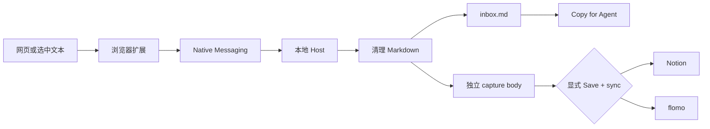

<p align="center">
  
</p>

<h1 align="center">Clipplane</h1>

<p align="center">
  把网页上该留下的部分，剪成可复查的本地 Markdown。
  <br>
  保存后可以自己处理，也可以直接交给 Agent；需要时再同步到 Notion 或 flomo。
</p>

<p align="center">
  <a href="README.en.md">English README</a> · <a href="https://kkenny0.github.io/Clipplane/">产品页</a> · <a href="https://kkenny0.github.io/Clipplane/setup/">安装</a> · <a href="https://kkenny0.github.io/Clipplane/privacy/">隐私</a> · <a href="https://kkenny0.github.io/Clipplane/support/">帮助</a>
</p>

<table>
  <tr>
    <th>剪藏弹窗</th>
    <th>设置页</th>
  </tr>
  <tr>
    <td valign="top"></td>
    <td valign="top"></td>
  </tr>
</table>

Clipplane 由浏览器扩展和本地 Native Messaging Host 组成。扩展负责捕获选区、可读正文或页面元素，本地 Host 清理内容并写入 notes 目录。每次剪藏都会先成为可追溯的本地 capture，是否交给 Agent 或同步到外部服务由你决定。

当前稳定版是 `0.8.0`。macOS arm64 可以安装已签名并公证的 Host 包；Windows x64 目前从固定源码安装。Chrome Web Store 和 Edge Add-ons 尚未上架。

## Clipplane 怎么工作



完整内容会先写入本地，再尝试任何外部同步。保存和本地处理不依赖 Claude Code、Codex CLI、Agent CLI 或 MCP。

## 安装

先从 [`v0.8.0` Release](https://github.com/KKenny0/Clipplane/releases/tag/v0.8.0) 下载并解压 `clipplane-extension-v0.8.0.zip`。

### macOS arm64

1. 从同一个 Release 下载并安装已签名的 `.pkg`。
2. 完全退出并重新打开 Chrome 或 Edge。
3. 按下方步骤加载浏览器扩展。

### Windows x64

Windows 需要 Git、Node 24.13 或更高的 Node 24 版本。Host `0.8.0` 使用下面这个经过审核的固定源码 commit：

```powershell
$clipplaneCommit = "ffe658b1820cafda130684f8b98b467052136426"
git clone https://github.com/KKenny0/Clipplane.git
Set-Location .\Clipplane
git checkout --detach $clipplaneCommit
if ((git rev-parse HEAD).Trim() -ne $clipplaneCommit) { throw "Clipplane commit verification failed." }
npm ci --omit=dev --ignore-scripts
npm run smoke
pwsh -NoLogo -NoProfile -File .\scripts\setup-windows.ps1 -Browser chrome
```

Edge 用户把最后一行的 `chrome` 改成 `edge`。不要执行 tag 页面自动生成的 `Source code` 压缩包。

### 加载浏览器扩展

1. 打开 `chrome://extensions` 或 `edge://extensions`。
2. 开启 `Developer mode`。
3. 点击 `Load unpacked`。
4. 选择解压后的 `clipplane-extension-v0.8.0` 目录，或源码仓库里的 `extension` 目录。
5. 确认扩展 ID 是 `emacefnmbogjdcblglmipolnickjnmbl`。

打开 Clipplane 弹窗，状态显示 `Ready` 即可开始使用。从源码安装时也可以运行：

```powershell
npm run doctor
```

如果弹窗显示 `Host unavailable`，复制弹窗给出的 setup 命令并重新运行。出现 `Specified native messaging host not found` 时，对当前浏览器重新执行 setup；出现 `Access to the specified native messaging host is forbidden` 时，先确认扩展 ID，再重新执行 setup。

## 开始剪藏

打开任意网页，点击 Clipplane 扩展：

- `Selection`：保存当前选中的文本；没有选中文本时回退到页面剪藏。
- `Page`：优先提取可读正文，失败时回退到经过本地去噪的页面内容。
- `Element`：点击 `Choose area`，再点选一段、卡片、评论或页面区域。
- `Save local`：只保存到本地。
- `Save + sync`：先保存到本地，再同步到已启用的外部服务。

也可以选中一段文字后用右键菜单剪藏。

## 剪藏后交给 Agent

剪藏成功后，结果卡的主动作是 `Copy for Agent`。它会复制标题、来源和当前设备上的 Markdown 正文路径，可以直接粘贴到本地 Agent session。

每条 capture 都有独立的 Markdown body，固定 YAML frontmatter 保存标题、来源、作者、发布时间、创建时间、标签和捕获方式，后面是原始正文。Agent 只读取这一份文件就能获得完整上下文。

`History` 用来查看 capture 方法、正文状态和同步结果。`Copy content` 适合无法读取本机文件的 Agent；`Mark processed` 会从 `inbox.md` 移除条目，但保留历史和正文；再次剪藏会让它回到 Active Inbox。`Delete local copy` 会删除 Inbox 条目、历史记录、正文快照和 Clipplane 管理的 local-export。

## 本地文件与 History

默认写入：

- `~/Documents/notes/inbox.md`
- `~/Documents/notes/.clipplane/captures.jsonl`
- `~/Documents/notes/.clipplane/captures/<capture-id>.md`

`inbox.md` 是待处理工作区。`.clipplane` 下的记录和正文由 Clipplane 管理，用于 History、去重、恢复和同步。`captures.jsonl` 不保存设备绝对路径，因此整个 notes 目录可以放进 Git，并在不同系统或用户目录之间移动。

这套 Git 用法假设同一时间只有一台设备写入：先在一台设备提交并推送，再在另一台设备拉取后继续使用。Clipplane 不会自动运行 Git，也不会解决两台设备同时修改 `captures.jsonl` 或 `inbox.md` 产生的冲突。

<details>
<summary>从 0.7.x 的 Org Inbox 升级</summary>

首次升级时，Host 会保留原 `inbox.org`，并创建 `.clipplane/backups/inbox-v2.org` 和 `.clipplane/backups/captures-v2.jsonl` 两份不可变备份。已有正文会无损包装为 Capture Document，包装前版本保存在 `.clipplane/backups/capture-bodies-v0/`。

active 记录缺少正文时，只有对应 Org 条目包含非空正文才会恢复，并标记 `recovery: "legacy_org"`。迁移验证完成后，运行时只写 Markdown。若 Org 在迁移期间被编辑、目标 Markdown 已存在、备份冲突或旧 Inbox 含非 Clipplane 管理的前置内容，迁移会停止，不覆盖或删除原文件。

迁移完成后不要降级到不支持可移植记录的旧 Host。若当前 Host 遇到由更新版本写入的记录，History 仍然可读，但会拒绝修改该记录，直到 Host 升级。

</details>

## 同步与隐私

Clipplane 不监听剪贴板，不默认上传内容，也不会自动运行分析 skill。只有主动点击扩展按钮或右键菜单才会剪藏，只有点击 `Save + sync` 才会把内容发送到已启用的外部服务。同步失败不会影响本地保存。

- flomo：开启 flomo，粘贴 incoming webhook URL，可选填写 tags。官方说明见 [API & URL Scheme](https://help.flomoapp.com/advance/api.html) 和 [incoming webhook](https://flomoapp.com/mine?source=incoming_webhook)。flomo API 需要 Pro 权限。
- Notion：开启 Notion，填写 page ID 和 integration token，并把目标 page 授权给对应 connection。官方说明见 [Notion API quickstart](https://developers.notion.com/guides/get-started/quick-start) 和 [Authorization](https://developers.notion.com/guides/get-started/authorization)。

`Copy diagnostics` 只复制操作系统、架构、浏览器、扩展、Host、协议和错误码，不包含 notes 路径、网页内容或同步凭据。完整数据边界见[隐私政策](PRIVACY.md)。

## 常见问题

- `Nothing to clip`：先选中文本，或使用 `Page` 模式抓取页面正文。
- 页面剪藏不理想：文章和文档优先用 `Page`；应用和非文章页面可用 `Element` 点选目标区域；需要精确文本时用 `Selection`。
- `Element` 无法启动：浏览器内部页、Chrome Web Store 和跨域 iframe 受到浏览器隔离限制，无法剪藏。
- `Capture history` 提示跳过 unreadable record：通常是 `captures.jsonl` 中有一行损坏。Clipplane 会跳过坏行并继续显示其他剪藏。

更多安装问题见[帮助页](https://kkenny0.github.io/Clipplane/support/)。

## 开发与发布

```text
extension/           Manifest V3 浏览器扩展
native-host/         Native Messaging Host 和剪藏核心
scripts/             安装、卸载、smoke、doctor 和打包脚本
test/                基于 node:test 的核心测试
```

常用命令：

```powershell
npm test
npm run smoke
npm run doctor
npm run package:extension
npm run verify:extension
npm run package:store
npm run verify:store
```

- [高级配置](docs/configuration.md)：环境变量、自定义扩展 ID、配置文件和凭据存储。
- [发布与信任链](docs/releasing.md)：扩展身份、Host 资产、签名、公证、打包和安装器验收。
- [隐私政策](PRIVACY.md)：本地数据、外部同步和凭据边界。

## 致谢与支持

Clipplane 最初参考了 [lijigang/ljg-skill-clip](https://github.com/lijigang/ljg-skill-clip) 的本地优先剪藏流程，保留“捕获、清理、打标签、进入 Inbox”的骨架，并把运行时输出统一为人和 Agent 都能直接读取的 Markdown。

如果 Clipplane 节省了你剪藏网页、整理本地 Inbox 或同步到 Notion、flomo 的时间，可以在这里支持持续维护：

<https://kkenny0.github.io/support/>
