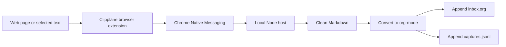

# Clipplane

Clipplane is a local-first browser clipper. It captures the current page or selected text, sends it through a Native Messaging host, and appends a clean org-mode entry to `~/Documents/notes/inbox.org`.

Phase 1 deliberately keeps the product narrow:

- browser action and context-menu clipping
- local Native Messaging host
- `inbox.org` as the human-readable source of truth
- `.clipplane/captures.jsonl` as the machine-readable audit and retry log
- duplicate detection by content hash

flomo MCP and Apple Notes are planned sinks, not Phase 1 dependencies. Local save succeeds or fails independently of any external service.

## Reference Workflow

Clipplane Phase 1 follows the clipping workflow from [lijigang/ljg-skill-clip](https://github.com/lijigang/ljg-skill-clip): capture a URL or text selection, clean it into Markdown, convert it into org-mode, tag it, and append it to a local `inbox.org`. Clipplane turns that workflow into a browser-triggered local app while keeping the same local-first storage boundary.

## How It Works



The first release is intentionally local-only. A successful clip means the content is written to local files; external sinks such as flomo MCP and Apple Notes will be added after this local loop stays reliable.

## Layout

```text
extension/           Manifest V3 browser extension
native-host/         Native Messaging host and clip core
scripts/             install, uninstall, smoke, and doctor scripts
test/                node:test coverage for clip core and framing
```

## Develop

Run tests:

```powershell
pwsh -NoLogo -NoProfile -Command "npm test"
```

Run a local smoke clip without the browser:

```powershell
pwsh -NoLogo -NoProfile -Command "npm run smoke"
```

Run environment checks:

```powershell
pwsh -NoLogo -NoProfile -Command "npm run doctor"
```

## Quick Local Smoke Test

Before loading the extension, verify the local clip core:

```powershell
pwsh -NoLogo -NoProfile -Command "npm run smoke"
```

This writes a temporary `inbox.org` under the system temp directory and prints the captured org entry.

## Load The Extension

1. Open `chrome://extensions` or `edge://extensions`.
2. Enable Developer mode.
3. Click "Load unpacked".
4. Select the `extension` folder.
5. Copy the generated extension ID.

## Install The Native Host On Windows

Install for Chrome:

```powershell
pwsh -NoLogo -NoProfile -File .\scripts\install-native-host.ps1 -Browser chrome -ExtensionId "<extension-id>"
```

Install for Edge:

```powershell
pwsh -NoLogo -NoProfile -File .\scripts\install-native-host.ps1 -Browser edge -ExtensionId "<extension-id>"
```

The installer writes `native-host/com.clipplane.host.json` and registers it under the current user's Native Messaging registry key.

Verify the Chrome host registration:

```powershell
pwsh -NoLogo -NoProfile -File .\scripts\check-native-host.ps1 -Browser chrome -ExtensionId "<extension-id>"
```

Uninstall:

```powershell
pwsh -NoLogo -NoProfile -File .\scripts\uninstall-native-host.ps1 -Browser chrome
```

## Data Files

By default Clipplane writes:

- `~/Documents/notes/inbox.org`
- `~/Documents/notes/.clipplane/captures.jsonl`

Override the notes directory with `CLIPPLANE_NOTES_DIR` before launching the native host or by editing the generated launcher.

## Current Scope

Clipplane does not watch the clipboard, does not upload data by default, and does not run analysis skills automatically. It only clips when the user explicitly clicks the extension action or context menu.

## Troubleshooting

- `Specified native messaging host not found`: run `check-native-host.ps1` for the browser you loaded the extension in.
- `Access to the specified native messaging host is forbidden`: reinstall with the exact extension ID shown on `chrome://extensions` or `edge://extensions`.
- `Nothing to clip`: select text first or use "Clip Page" so Clipplane can collect the page body.
- Empty or noisy page clips: clip a selection. Phase 1 uses a lightweight DOM extractor instead of a full readability engine.
