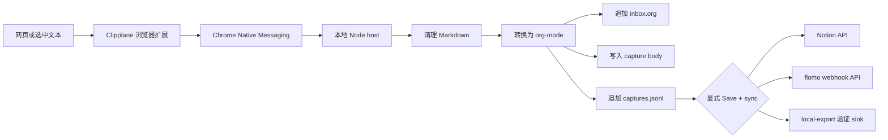

<p align="center">
  
</p>

<h1 align="center">Clipplane</h1>

<p align="center">
  先把网页剪藏留在你的电脑上。
  <br>
  一键保存网页或选中文本到本地 <code>inbox.org</code>，之后可以检查完整剪藏轨迹，也可以在需要时手动同步到 Notion 或 flomo。
</p>

<p align="center">
  <a href="README.en.md">English README</a> · <a href="PRIVACY.md">隐私政策</a>
</p>

Clipplane 是本地优先的网页剪藏工具，由浏览器扩展和本地 Native Messaging host 组成。扩展负责捕获页面或选中文本，本地 host 负责清理内容、转换为 org-mode，并写入本地 notes 目录。外部服务只是可选同步目标，不影响本地保存。

## 当前状态

Clipplane 仍是 dev preview：

- GitHub Release 提供打包好的扩展 zip，用于手动 `Load unpacked`，扩展 ID 固定为 `mhgcfphfcgbgabhbegdonadkedfaddhc`。
- 本地 host 和 setup 脚本来自源码仓库，或 Release 自带的 `Source code` 包。
- 目前还没有上架 Chrome Web Store 或 Edge Add-ons；Chrome Web Store 不是 v0.4 的依赖。
- setup 默认使用固定 extension ID，普通用户不需要复制浏览器生成的 ID。
- Edge Add-ons 可以作为后续免费商店分发路径单独推进。

Chrome Native Messaging 要求本地 host 明确列出允许访问它的扩展来源，不能使用通配符。Clipplane 的 `manifest.key` 是公开身份 key，用于让手动加载的扩展保持稳定 ID；它不是签名私钥，仓库也不保存 `.pem` 或其他私钥文件。

## 5 分钟开始

### 1. 准备文件

如果你从 Release 试用，下载两样东西：

- `Source code`：本地 host 和 setup 脚本。
- `clipplane-extension-vX.zip`：浏览器要加载的扩展包。

把两者解压到固定目录。然后在 `Source code` 目录里运行：

```powershell
npm install
npm run smoke
```

如果你直接从 Git 仓库运行，也是在仓库根目录执行同样命令。`smoke` 会在系统临时目录写入一份测试用 `inbox.org`，用来确认本地剪藏核心可以工作。

### 2. 加载浏览器扩展

1. 打开 `chrome://extensions` 或 `edge://extensions`。
2. 开启 `Developer mode`。
3. 点击 `Load unpacked`。
4. 选择解压后的 `clipplane-extension-vX` 目录，或源码仓库里的 `extension` 目录。
5. 确认浏览器显示的 extension ID 是 `mhgcfphfcgbgabhbegdonadkedfaddhc`。

### 3. 注册本地 host

Windows Chrome：

```powershell
pwsh -NoLogo -NoProfile -File .\scripts\setup-windows.ps1 -Browser chrome
```

Windows Edge：

```powershell
pwsh -NoLogo -NoProfile -File .\scripts\setup-windows.ps1 -Browser edge
```

macOS Chrome：

```bash
bash scripts/setup-macos.sh --browser chrome
```

macOS Edge：

```bash
bash scripts/setup-macos.sh --browser edge
```

### 4. 检查安装

```powershell
npm run doctor
```

如果扩展弹窗显示 `Host unavailable`，先复制弹窗里的 setup 命令并重新运行。开发版或自定义 manifest 才需要在高级模式下传入手动 extension ID。

### 5. 开始剪藏

打开任意网页，点击 Clipplane 扩展：

- `Selection`：保存当前选中的文本；没有选中文本时会回退到页面剪藏。
- `Page`：优先提取可读正文，失败时回退到经过本地去噪的页面内容。
- `Element`：点击 `Choose area` 后，在页面中点选一段、卡片、评论或区域。
- `Save local`：只保存到本地；`Save + sync`：先保存到本地，再同步到已启用的外部 sink。

也可以选中一段文字后用右键菜单剪藏。

## 产品预览

<table>
  <tr>
    <th>剪藏弹窗</th>
    <th>设置页</th>
  </tr>
  <tr>
    <td valign="top"></td>
    <td valign="top"></td>
  </tr>
</table>

### Notion 同步

启用 Notion sink 后，`Save + sync` 会先保存到本地，再在目标 Notion page 下创建页面。

<table>
  <tr>
    <th>Clipplane 中触发同步</th>
    <th>Notion 中生成页面</th>
  </tr>
  <tr>
    <td valign="top"></td>
    <td valign="top"></td>
  </tr>
</table>

## Clipplane 保存什么

默认保存到：

- `~/Documents/notes/inbox.org`
- `~/Documents/notes/.clipplane/captures.jsonl`
- `~/Documents/notes/.clipplane/captures/<capture-id>.md`

`inbox.org` 是人可读的主文件。`captures.jsonl` 和 `captures/` 是机器可读的审计、重试和同步记录。Clipplane 会用内容 hash 跳过重复剪藏。

扩展里的 `Settings` 分为 `Storage`、`History` 和 `Sync` 三个标签页。你可以在 `Storage` 查看或修改保存目录，在 `History` 检查最近剪藏、本地 body 文件、捕获方式和同步状态，在 `Sync` 配置 Notion 或 flomo。普通用户不需要设置环境变量，也不需要编辑 launcher。

## 外部同步

外部 sink 默认关闭。启用时需要在 Settings 明确确认外部服务会收到的内容；确认和配置完成后，弹窗里的 `Save + sync` 才会可用。同步失败不会影响本地保存。完整数据边界见 [隐私政策](PRIVACY.md)。

- flomo：开启 flomo，粘贴 incoming webhook URL，可选填写 tags。官方入口：[API & URL Scheme](https://help.flomoapp.com/advance/api.html)，webhook 页面：[flomo incoming webhook](https://flomoapp.com/mine?source=incoming_webhook)。flomo API 需要 Pro 权限。
- Notion：开启 Notion，填写 page ID 和 integration token。官方入口：[Notion API quickstart](https://developers.notion.com/guides/get-started/quick-start) 和 [Authorization](https://developers.notion.com/guides/get-started/authorization)。目标 page 需要授权给对应 connection，否则 API 无法写入。

`notion-api` 通过 Notion 官方 API 创建页面，不走 Notion MCP。`flomo-api` 调用 flomo incoming webhook API。`local-export` 会把同步结果写到 `.clipplane/sinks/local-export/`，主要用于本地验证。

## 参考工作流

Clipplane 的剪藏链路参考了 [lijigang/ljg-skill-clip](https://github.com/lijigang/ljg-skill-clip)：捕获 URL 或选中文本，清理为 Markdown，转换为 org-mode，打标签，追加到本地 `inbox.org`。Clipplane 把这条链路变成浏览器可触发的本地应用，同时保留本地优先的存储边界。

## 工作方式



Native host 会先把完整内容写到本地，再尝试任何同步。Phase 2 的同步使用直接 API，不需要 Claude Code、Codex CLI、Agent CLI 或 MCP 才能保存和同步剪藏。

## 开发

目录结构：

```text
extension/           Manifest V3 浏览器扩展
native-host/         Native Messaging host 和剪藏核心
scripts/             安装、卸载、smoke、doctor、打包脚本
test/                基于 node:test 的核心逻辑测试
```

常用命令：

```powershell
npm test
npm run smoke
npm run smoke:sync:local
npm run doctor
npm run package:extension
```

`npm run package:extension` 会生成 `dist/clipplane-extension-vX.zip`，用于 GitHub Release 附件。这个 zip 只包含浏览器扩展，native host 仍随源码包分发。打包前会从受版本锁定的 `@mozilla/readability` 准备正文提取器及 Apache-2.0 许可证。打包脚本会拒绝 `.pem`、`.key`、`.p12`、`.pfx`、`.env*` 和 Native Messaging 本机 manifest 进入扩展包。

<details>
<summary>高级配置</summary>

Settings 页面会写入本机应用配置文件。你仍然可以用环境变量做开发调试：

```powershell
$env:CLIPPLANE_NOTES_DIR = "D:\notes"
$env:CLIPPLANE_NOTION_TOKEN = "secret_xxx"
$env:CLIPPLANE_FLOMO_WEBHOOK_URL = "https://flomoapp.com/iwh/..."
```

浏览器启动的 Native Messaging host 只能读取浏览器进程可见的环境变量，所以普通使用不建议走这条路径。

如果你在开发自定义扩展 identity，可以手动覆盖 extension ID：

```powershell
pwsh -NoLogo -NoProfile -File .\scripts\setup-windows.ps1 -Browser chrome -ExtensionId "<extension-id>"
```

```bash
bash scripts/setup-macos.sh --browser chrome --extension-id "<extension-id>"
```

配置文件结构：

```json
{
  "storage": {
    "notesDir": "D:\\notes"
  },
  "sync": {
    "defaultSinks": ["notion-api"]
  },
  "sinks": {
    "notion-api": {
      "enabled": true,
      "parentType": "page",
      "parentId": "NOTION_PAGE_ID",
      "token": "secret_xxx"
    },
    "flomo-api": {
      "enabled": false,
      "webhookUrl": "https://flomoapp.com/iwh/...",
      "tags": ["clipplane"]
    },
    "local-export": {
      "enabled": false
    }
  }
}
```

</details>

## 当前边界

Clipplane 不监听剪贴板，不默认上传内容，也不会自动运行分析 skill。它只在用户明确点击扩展按钮或右键菜单时剪藏，只在用户点击 `Save + sync` 时外部同步。`Element` 模式的高亮和点击监听只在用户启动选择后临时存在，确认、取消或超时后立即移除。

## 排查

- `Specified native messaging host not found`：对当前浏览器重新运行 setup 命令，再运行 `npm run doctor`。
- `Access to the specified native messaging host is forbidden`：确认扩展 ID 是 `mhgcfphfcgbgabhbegdonadkedfaddhc`，然后重新运行对应浏览器的 setup 命令。
- `Nothing to clip`：先选中文本，或使用 `Page` 模式让 Clipplane 抓取页面正文。
- 页面剪藏不理想：先使用 `Page` 模式，它会优先提取正文并自动回退；文章、文档以外的页面可改用 `Element` 点选目标区域，或使用 `Selection` 保存精确文本。
- `Element` 模式无法启动：浏览器内部页、Chrome Web Store 和跨域 iframe 受到浏览器隔离限制，无法剪藏。
- `Capture history` 提示跳过 unreadable record：通常是 `captures.jsonl` 中有一行损坏；Clipplane 会跳过坏行并继续显示其他剪藏。

## 支持 Clipplane

如果 Clipplane 节省了你剪藏网页、整理本地 inbox，或同步到 Notion / flomo 的时间，可以在这里支持持续维护：

<https://kkenny0.github.io/support/>

支持会帮助我继续维护浏览器扩展、本地 Native Messaging host、跨平台安装流程、同步 sink 和文档。
