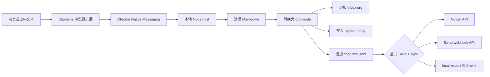

# Clipplane

> 本地优先的浏览器剪藏工具：把网页或选中文本保存到本地 `inbox.org`，再按需同步到 Notion 或 flomo。

[English README](README.en.md)

Clipplane 会把浏览器里的页面正文或选中文本交给本机 Native Messaging host，清理成 Markdown，转换为 org-mode 条目，并追加到 `~/Documents/notes/inbox.org`。外部服务是可选同步目标，不是保存成功的前置条件。

## 产品预览

<table>
  <tr>
    <th>剪藏弹窗</th>
    <th>设置页</th>
  </tr>
  <tr>
    <td valign="top"></td>
    <td valign="top"></td>
  </tr>
</table>

## 它解决什么

Clipplane 的第一原则很简单：剪藏内容必须先落到用户自己的本地文件里。

- 浏览器按钮和右键菜单触发剪藏
- Native Messaging host 在本机处理内容
- `inbox.org` 是人可读的主入口
- `.clipplane/captures.jsonl` 是机器可读的审计和重试日志
- 用内容 hash 跳过重复剪藏
- 可选同步到 Notion API 或 flomo webhook API

本地保存和外部同步解耦。用户点击 `Save local` 时只写本地；点击 `Save + sync` 时，才会在本地保存后尝试同步到已配置的 sink。

## 参考工作流

Clipplane 的剪藏链路参考了 [lijigang/ljg-skill-clip](https://github.com/lijigang/ljg-skill-clip)：捕获 URL 或选中文本，清理为 Markdown，转换为 org-mode，打标签，追加到本地 `inbox.org`。Clipplane 把这条链路变成浏览器可触发的本地应用，同时保留本地优先的存储边界。

## 工作方式



Native host 会先把完整内容写到本地，再尝试任何同步。Phase 2 的同步使用直接 API，不需要 Claude Code、Codex CLI、Agent CLI 或 MCP 才能保存和同步剪藏。

## 目录结构

```text
extension/           Manifest V3 浏览器扩展
native-host/         Native Messaging host 和剪藏核心
scripts/             安装、卸载、smoke、doctor 脚本
test/                基于 node:test 的核心逻辑测试
```

## 开发

运行测试：

```powershell
pwsh -NoLogo -NoProfile -Command "npm test"
```

不通过浏览器跑一次本地剪藏 smoke：

```powershell
pwsh -NoLogo -NoProfile -Command "npm run smoke"
```

不访问网络跑一次本地同步 smoke：

```powershell
pwsh -NoLogo -NoProfile -Command "npm run smoke:sync:local"
```

检查本机环境：

```powershell
pwsh -NoLogo -NoProfile -Command "npm run doctor"
```

## 快速本地验证

加载扩展前，先验证本地剪藏核心：

```powershell
pwsh -NoLogo -NoProfile -Command "npm run smoke"
```

这会在系统临时目录下写入一个临时 `inbox.org`，并打印生成的 org 条目。

## 加载浏览器扩展

1. 打开 `chrome://extensions` 或 `edge://extensions`。
2. 开启 Developer mode。
3. 点击 `Load unpacked`。
4. 选择仓库里的 `extension` 目录。
5. 复制浏览器生成的 extension ID。

## 在 Windows 安装 Native Host

安装到 Chrome：

```powershell
pwsh -NoLogo -NoProfile -File .\scripts\install-native-host.ps1 -Browser chrome -ExtensionId "<extension-id>"
```

安装到 Edge：

```powershell
pwsh -NoLogo -NoProfile -File .\scripts\install-native-host.ps1 -Browser edge -ExtensionId "<extension-id>"
```

安装脚本会生成 `native-host/com.clipplane.host.json`，并把 Native Messaging host 注册到当前用户的浏览器 registry key。

检查 Chrome host 注册：

```powershell
pwsh -NoLogo -NoProfile -File .\scripts\check-native-host.ps1 -Browser chrome -ExtensionId "<extension-id>"
```

卸载：

```powershell
pwsh -NoLogo -NoProfile -File .\scripts\uninstall-native-host.ps1 -Browser chrome
```

## 数据文件

默认写入：

- `~/Documents/notes/inbox.org`
- `~/Documents/notes/.clipplane/captures.jsonl`
- `~/Documents/notes/.clipplane/captures/<capture-id>.md`

打开扩展里的 `Settings` 可以查看当前保存目录、修改保存目录，或直接打开本地文件夹。普通用户不需要设置环境变量，也不需要编辑 launcher。

Clipplane 的应用设置保存在系统应用配置目录里；剪藏内容仍然保存在你选择的 notes 目录里。

## 外部 Sink

外部 sink 默认关闭。在扩展的 `Settings` 页面配置：

- flomo：开启 flomo，粘贴 incoming webhook URL，可选填写 tags。官方入口：[API & URL Scheme](https://help.flomoapp.com/advance/api.html)，webhook 页面：[flomo incoming webhook](https://flomoapp.com/mine?source=incoming_webhook)。flomo API 需要 Pro 权限。
- Notion：开启 Notion，填写 page ID 和 integration token。官方入口：[Notion API quickstart](https://developers.notion.com/guides/get-started/quick-start) 和 [Authorization](https://developers.notion.com/guides/get-started/authorization)。目标 page 需要授权给对应 connection，否则 API 无法写入。

配置完成后，弹窗里的 `Save + sync` 会变为可用。同步失败不会影响本地保存。

`notion-api` 会通过 Notion 官方 API 创建页面，不走 Notion MCP。`flomo-api` 会调用 flomo incoming webhook API，需要 flomo Pro 权限。`local-export` 会把同步结果写到 `.clipplane/sinks/local-export/`，主要用于本地验证。

<details>
<summary>高级配置</summary>

Settings 页面会写入本机应用配置文件。你仍然可以用环境变量做开发调试：

```powershell
$env:CLIPPLANE_NOTES_DIR = "D:\notes"
$env:CLIPPLANE_NOTION_TOKEN = "secret_xxx"
$env:CLIPPLANE_FLOMO_WEBHOOK_URL = "https://flomoapp.com/iwh/..."
```

浏览器启动的 Native Messaging host 只能读取浏览器进程可见的环境变量，所以普通使用不建议走这条路径。

配置文件结构：

```json
{
  "storage": {
    "notesDir": "D:\\notes"
  },
  "sync": {
    "defaultSinks": ["notion-api"]
  },
  "sinks": {
    "notion-api": {
      "enabled": true,
      "parentType": "page",
      "parentId": "NOTION_PAGE_ID",
      "token": "secret_xxx"
    },
    "flomo-api": {
      "enabled": false,
      "webhookUrl": "https://flomoapp.com/iwh/...",
      "tags": ["clipplane"]
    },
    "local-export": {
      "enabled": false
    }
  }
}
```

</details>

## 当前边界

Clipplane 不监听剪贴板，不默认上传内容，也不会自动运行分析 skill。它只在用户明确点击扩展按钮或右键菜单时剪藏，只在用户点击 `Save + sync` 时外部同步。

## 排查

- `Specified native messaging host not found`：对当前浏览器运行 `check-native-host.ps1`。
- `Access to the specified native messaging host is forbidden`：用 `chrome://extensions` 或 `edge://extensions` 里显示的准确 extension ID 重新安装。
- `Nothing to clip`：先选中文本，或使用 `Page` 模式让 Clipplane 抓取页面正文。
- 页面剪藏为空或噪声太多：优先选中文本剪藏。当前阶段使用轻量 DOM 提取器，不是完整 readability engine。
